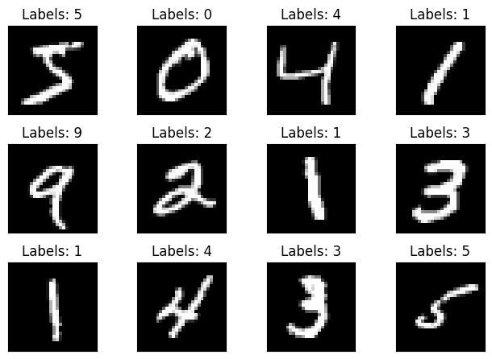
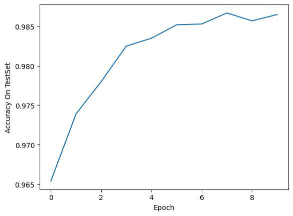
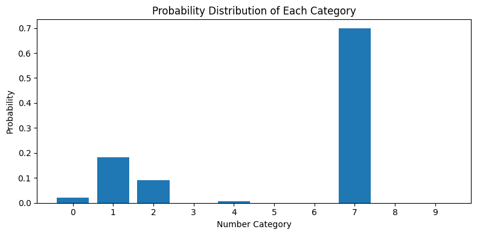

<div align="center">
	<h1>MNIST Handwritten Digit Recognition</h1>
	MNIST handwritten digit recognition / MNIST 手写数字识别
</div>

## 一、环境配置

> [!tip]
>
> 默认已安装 [Anaconda](https://www.anaconda.com/)
>
> 撰写该文档的测试环境：
>
> - OS：Windows 11
> - GPU：NVIDIA MAX450
> - CUDA：10.2

### 1.1 创建 conda 环境

```bash
 conda create --name mnist_hdwritten_rec python=3.9 -y
 conda activate mnist_hdwritten_rec
```

### 1.2 安装 Pytorch

1. 安装 [Pytorch](https://pytorch.org/get-started/previous-versions/)

    ```bash
    pip install "pytorch/torch-1.10.1+cu102-cp38-cp38-win_amd64.whl"
    pip install "pytorch/torchaudio-0.10.1+cu102-cp38-cp38-win_amd64.whl"
    pip install "pytorch/torchvision-0.11.2+cu102-cp38-cp38-win_amd64.whl"
    ```

    > [!note]
    >
    > 由于本人在线安装 Pytorch 会导致 GPU 无法使用，这里是使用`.whl` 文件离线安装。
    >
    > `pytorch` 文件夹没有上传，因此以上 `.whl` 文件的路径不存在：
    >
    > - 若要在线下载，请参考网络上有关 Pytorch 的在线安装教程；
    > - 若要离线下载，请寻找适配自己环境的 `.whl` 文件进行安装。

2. 测试 Pytorch 是否成功安装

    ```python
    import torch
    import torchvision
    print('Pytorch version:', torch.__version__)
    print('CUDA is available?:', torch.cuda.is_available())
    ```

    类似如下输出即为成功：
    
    

### 1.3 安装其他依赖

```bash
pip install pillow
pip install matplotlib
pip install opencv-python
```

---

## 二、MNIST 数据集

**MNIST** (Modified National Institute of Standards and Technology) 数据集是大型手写数字数据库，常被用于训练各种图像处理系统。数据集由美国的 NIST 机构收集，后来被人们修改和标准化，成为了机器学习领域最广泛使用的数据集之一。

数据集包含 60,000 个训练样本和 10,000 个测试样本。每个样本都是一张 **28x28** 像素的灰度图像（只有一个通道），包含 0 到 9 的一个数字。每张图像都经过中心化和规格化处理，数字的显示在图像居中的位置。

数据集构建的目标是让机器学习模型能够识别和分类手写数字。由于其规模适中且问题定义明确，MNIST 数据集也常被用作基准测试，用来比较不同的机器学习算法。

MNIST文件包含四个不属于任何标准格式的文件，因此它们**需要通过编程进行可视化查阅**，或者也可以使用 PyTorch 的`torchvision.datasets.MINIST` API 接口直接读取。

### 2.1 MNIST 数据集下载

1. 官网下载：https://yann.lecun.com/exdb/mnist/

2. 通过 PyTorch 的官方 API 下载:

    ```python
    from torchvision import datasets
    
    # train=True训练集，=False测试集
    train_dataset = datasets.MNIST('./datasets/mnist',train=True,download=True)
    test_dataset = datasets.MNIST('./datasets/mnist',train=False,download=True)
    ```
    
    - `./datasets/mnist` 是下载路径；
    - `train=True` 表示下载 60,000 个训练样本，`train=Fasle` 表示下载 10000 个测试样本；
    - 第一次下载把 `download` 的参数设置为 `True`，下载到本地后可以把 `download` 的参数设置为 `False`，代码可以直接到路径里读取 MNIST 数据集。

MNIST 数据集一共 4 个文件，训练集、训练集标签、测试集、测试集标签：

|    类别    |           文件名           |                内容                 |
| :--------: | :------------------------: | :---------------------------------: |
| 训练集图像 | train-images-idx3-ubyte.gz | 55000张训练集图片，5000张验证集图片 |
| 训练集标签 | train-labels-idx1-ubyte.gz |        训练集图片对应的标签         |
| 测试集图像 | t10k-images-idx3-ubyte.gz  |          10000张测试集图片          |
| 测试集标签 | t10k-labels-idx1-ubyte.gz  |        测试集图片对应的标签         |

### 2.2 可视化 MNIST 数据集

#### 2.2.1 导入必要库

```python
from matplotlib import pyplot as plt
from torchvision import datasets
```

#### 2.2.2 载入数据集

```python
train_dataset = datasets.MNIST(root='./datasets/mnist', train=True, download=True)
test_dataset = datasets.MNIST(root='./datasets/mnist', train=False, download=True)
```

#### 2.2.4 可视化数据集

```python
fig = plt.figure()
for i in range(12):
    plt.subplot(3, 4, i+1)
    plt.tight_layout()
    plt.imshow(train_dataset.train_data[i], cmap='gray', interpolation='none')
    plt.title("Labels: {}".format(train_dataset.train_labels[i]))
    plt.xticks([])
    plt.yticks([])
plt.show()
```



### 2.3 完整代码

```python
from matplotlib import pyplot as plt
from torchvision import datasets

train_dataset = datasets.MNIST(root='./datasets/mnist', train=True, download=True)
test_dataset = datasets.MNIST(root='./datasets/mnist', train=False, download=True)

fig = plt.figure()
for i in range(12):
    plt.subplot(3, 4, i+1)
    plt.tight_layout()
    plt.imshow(train_dataset.train_data[i], cmap='gray', interpolation='none')
    plt.title("Labels: {}".format(train_dataset.train_labels[i]))
    plt.xticks([])
    plt.yticks([])
plt.show()
```

---

## 三、模型训练

### 3.1 导入必要库

```python
import torch
import numpy as np
from matplotlib import pyplot as plt
from torch.utils.data import DataLoader
from torchvision import transforms
from torchvision import datasets
import torch.nn.functional as F
```

### 3.2 超参数配置

```python
batch_size = 64       # 批处理大小，每次训练使用的样本数量
learning_rate = 0.01  # 学习率，控制每次参数更新的步长
momentum = 0.5        # 动量参数，帮助优化器在相关方向上加速并抑制震荡
EPOCH = 10            # 训练轮数，完整遍历训练集的次数
```

### 3.3 导入数据集

#### 3.3.1 归一化

\- 0.1307 是 `mean` 均值

\- 0.3081 是 `std` 标准差

```python
transform = transforms.Compose([transforms.ToTensor(), transforms.Normalize((0.1307), (0.3081))])
```

#### 3.3.2 载入数据集

```python
train_dataset = datasets.MNIST(root='./datasets/mnist', train=True, download=False, transform=transform)
test_dataset = datasets.MNIST(root='./datasets/mnist', train=False, download=False, transform=transform)
train_loader = DataLoader(train_dataset, batch_size=batch_size, shuffle=True)
test_loader = DataLoader(test_dataset, batch_size=batch_size, shuffle=False)
```

### 3.4 定义模型结构

```python
class Net(torch.nn.Module):
    def __init__(self):
        super(Net, self).__init__()
        self.conv1 = torch.nn.Sequential(
            torch.nn.Conv2d(1, 10, kernel_size=5),
            torch.nn.ReLU(),
            torch.nn.MaxPool2d(kernel_size=2),
        )
        self.conv2 = torch.nn.Sequential(
            torch.nn.Conv2d(10, 20, kernel_size=5),
            torch.nn.ReLU(),
            torch.nn.MaxPool2d(kernel_size=2),
        )
        self.fc = torch.nn.Sequential(
            torch.nn.Linear(320, 50),
            torch.nn.Linear(50, 10),
        )

    def forward(self, x):
        batch_size = x.size(0)
        x = self.conv1(x)  # 一层卷积层,一层池化层,一层激活层(图是先卷积后激活再池化，差别不大)
        x = self.conv2(x)  # 再来一次
        # flatten 变成全连接网络需要的输入 (batch, 20,4,4) ==> (batch,320), -1 此处自动算出的是320
        x = x.view(batch_size, -1)
        x = self.fc(x)
        return x  # 最后输出的是维度为10的，也就是（对应数学符号的0~9）
```

#### 3.5 实例化模型

```python
# 实例化模型
model = Net()

# 将模型移动到GPU（如果可用）
device = torch.device("cuda:0" if torch.cuda.is_available() else "cpu")
model = model.to(device)
```

### 3.6 定义损失函数和优化器

```python
criterion = torch.nn.CrossEntropyLoss()  # 交叉熵损失
optimizer = torch.optim.SGD(model.parameters(), lr=learning_rate, momentum=momentum)  # lr学习率，momentum冲量
```

### 3.7 训练轮

```python
def train(epoch):
    running_loss = 0.0  # 这整个epoch的loss清零
    running_total = 0
    running_correct = 0
    for batch_idx, data in enumerate(train_loader, 0):
        inputs, target = data
        # 将数据移动到GPU
        device = torch.device("cuda:0" if torch.cuda.is_available() else "cpu")
        inputs, target = inputs.to(device), target.to(device)
        optimizer.zero_grad()

        # forward + backward + update
        outputs = model(inputs)
        loss = criterion(outputs, target)

        loss.backward()
        optimizer.step()

        # 把运行中的loss累加起来，为了下面300次一除
        running_loss += loss.item()
        # 把运行中的准确率acc算出来
        _, predicted = torch.max(outputs.data, dim=1)
        running_total += inputs.shape[0]
        running_correct += (predicted == target).sum().item()

        if batch_idx % 300 == 299:  # 不想要每一次都出loss，浪费时间，选择每300次出一个平均损失,和准确率
            print('[%d, %5d]: loss: %.3f , acc: %.2f %%'
                  % (epoch + 1, batch_idx + 1, running_loss / 300, 100 * running_correct / running_total))
            running_loss = 0.0  # 这小批300的loss清零
            running_total = 0
            running_correct = 0  # 这小批300的acc清零
```

### 3.8 测试轮

```python
def test(epoch):
    correct = 0
    total = 0
    with torch.no_grad():  # 测试集不用算梯度
        for data in test_loader:
            images, labels = data
            images, labels = images.to(device), labels.to(device)
            outputs = model(images)
            # dim = 1 列是第0个维度，行是第1个维度，沿着行(第1个维度)去找1.最大值和2.最大值的下标
            _, predicted = torch.max(outputs.data, dim=1)
            total += labels.size(0)  # 张量之间的比较运算
            correct += (predicted == labels).sum().item()
    acc = correct / total
    print('[%d / %d]: Accuracy on test set: %.1f %% ' %
          (epoch+1, EPOCH, 100 * acc))  # 求测试的准确率，正确数/总数
    return acc
```

### 3.9 开始训练

```python
if __name__ == '__main__':
    acc_list_test = []
    for epoch in range(EPOCH):
        train(epoch)
        acc_test = test(epoch)
        acc_list_test.append(acc_test)

    plt.plot(acc_list_test)
    plt.xlabel('Epoch')
    plt.ylabel('Accuracy On TestSet')
    plt.show()
```



## 四、模型推理

### 4.1 图片推理

```python
# 导入必要的库
import matplotlib.pyplot as plt
from PIL import Image
import torchvision.transforms as transforms
import numpy as np

# 定义图像预处理
transform = transforms.Compose([
    transforms.Resize((28, 28)),  # 调整图像大小为模型输入尺寸
    transforms.ToTensor(),
    transforms.Normalize((0.1307,), (0.3081,))  # MNIST数据集的标准化参数
])

# 加载本地图片并进行预测
def predict_image(image_path):
    # 加载图片
    img = Image.open(image_path).convert('L')  # 转换为灰度图
    
    # 预处理图片
    img_tensor = transform(img).unsqueeze(0).to(device)
    
    # 显示预处理后的图像
    plt.figure(figsize=(4, 4))
    plt.imshow(img_tensor[0, 0].cpu().numpy(), cmap='gray')
    plt.axis('off')
    plt.show()
        
    # 进行预测
    model.eval()
    with torch.no_grad():
        output = model(img_tensor)
        _, predicted = torch.max(output, 1)
        prob = torch.nn.functional.softmax(output, dim=1)
    
    # 显示图片并在上方标注识别结果
    plt.figure(figsize=(8, 8))
    plt.imshow(img, cmap='gray')
    plt.title(f"Result: {predicted.item()}, Confidence: {prob[0][predicted].item():.2f}", fontsize=16)
    plt.axis('off')  # 不显示坐标轴
    plt.tight_layout()
    plt.show()
    
    # 额外显示概率分布图
    plt.figure(figsize=(8, 4))
    plt.bar(range(10), prob[0].cpu().numpy())
    plt.xticks(range(10))
    plt.xlabel("Number Category")
    plt.ylabel("Probability")
    plt.title("Probability Distribution of Each Category")
    plt.tight_layout()
    plt.show()
    
    return predicted.item(), prob[0][predicted].item()

# 使用示例
# 请替换为您自己的图片路径
image_path = "./img/7.png"
predicted_digit, confidence = predict_image(image_path)
print(f"预测结果: {predicted_digit}, 置信度: {confidence:.2f}")
```

<br>




### 4.2 视频推理

```python
# 导入所需的库
import cv2
import numpy as np
import torch
from PIL import Image
import matplotlib.pyplot as plt
from torchvision import transforms
import time

# 定义实时视频识别函数
def real_time_recognition():
    # 打开摄像头
    cap = cv2.VideoCapture(1)
    
    if not cap.isOpened():
        print("无法打开摄像头")
        return
    
    print("摄像头已打开，按 'q' 键退出")
    
    while True:
        # 读取一帧
        ret, frame = cap.read()
        
        if not ret:
            print("无法获取画面")
            break
        
        # 处理帧
        # 转换为灰度图
        gray = cv2.cvtColor(frame, cv2.COLOR_BGR2GRAY)
        
        # 调整大小为模型输入尺寸
        resized = cv2.resize(gray, (28, 28))
        
        # 转换为PIL图像
        pil_img = Image.fromarray(resized)
        
        # 预处理图像
        img_tensor = transform(pil_img).unsqueeze(0).to(device)
        
        # 进行预测
        model.eval()
        with torch.no_grad():
            output = model(img_tensor)
            _, predicted = torch.max(output, 1)
            prob = torch.nn.functional.softmax(output, dim=1)
        
        # 在原始帧上显示结果
        result_text = f"Prediction: {predicted.item()}, Confidence: {prob[0][predicted].item():.2f}"
        cv2.putText(frame, result_text, (10, 30), cv2.FONT_HERSHEY_SIMPLEX, 1, (0, 255, 0), 2)
        
        # 显示帧
        cv2.imshow('Real-Time Digit Recognition', frame)
        
        # 按q键退出
        if cv2.waitKey(1) & 0xFF == ord('q'):
            break
        
        # 控制帧率
        time.sleep(0.03)
    
    # 释放资源
    cap.release()
    cv2.destroyAllWindows()

# 运行实时识别
try:
    real_time_recognition()
except Exception as e:
    print(f"发生错误: {e}")
    # 确保资源被释放
    cv2.destroyAllWindows()

```

---

## Reference

- [经典数据集 MNIST（手写数字数据集）详解与可视化](https://blog.csdn.net/weixin_57506268/article/details/135055111)

- [详解 MNIST 数据集下载、解析及显示的 Python 实现](https://blog.csdn.net/KRISNAT/article/details/130670596?ops_request_misc=%257B%2522request%255Fid%2522%253A%2522a63d2e692c221a37889e24001fa40928%2522%252C%2522scm%2522%253A%252220140713.130102334..%2522%257D&request_id=a63d2e692c221a37889e24001fa40928&biz_id=0&utm_medium=distribute.pc_search_result.none-task-blog-2~all~top_positive~default-1-130670596-null-null.142^v100^pc_search_result_base9&utm_term=MNIST%20%E6%95%B0%E6%8D%AE%E9%9B%86&spm=1018.2226.3001.4187)

- [用 PyTorch实现 MNIST 手写数字识别（最新，非常详细）](https://blog.csdn.net/qq_45588019/article/details/120935828)
